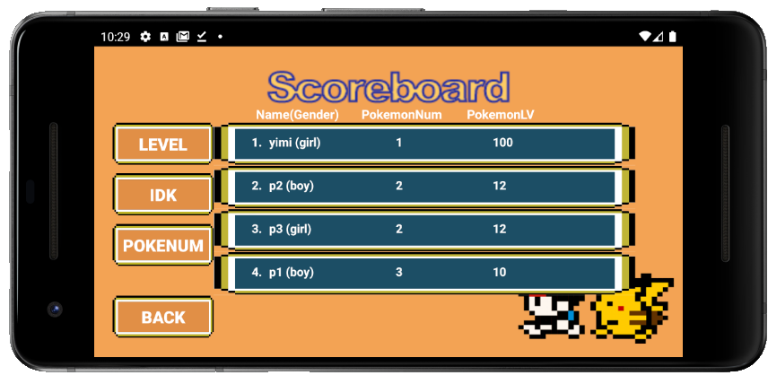

# UTFantasy
## Preview

## About

The Project has 2 phases.
Phase1 is not completely completed.
Phase2 is the final project.

Phase2 infomation.
#######
- NOTE: Our packages' name should all be lowercase, however, we cannot rename all packages into
lowercase because non fixable bugs.

- All UML diagrams are in UML folder, please take a look.

- We SIMPLIFY the game and put all elements in a small map for presentation.

- First, register a new account with account and password, create a new player with name and gender.
Every new player will have $1000 at beginning.

- You can only see the score board on the first page.

- (EASTER EGG)SuperUser: username: yimi ; password: 20191128 (it has a full level pokemon)

- Our game has the same structure as the game Pokemon. Basically, there are 3 types of game: map
walking, battle and shopping. Following by some small games such as healing, catch pokemon.

### MAP
- Use four buttons down on the left to control the player.

- Button "A" is confirm and Button "B" is cancel.

- There are three pokemon balls on the map. You MUST choose one of them to play the game.

- MENU -> BAG: you can see your products and pokemon by click the button on the left bottom.

- MENU -> SYSTEM: When you logout, all the information will be saved, while if you click save,
the information will be saved instantly.

- MENU -> PROFILE: you can check your profile.

- There are 6 npc who you can fight with using your pokemon. 5 of them stand for each of our
producers, and the last one with the white lab coat is the professor.

- There is a Sales npc on the right of the professor, you can buy different products from her.
We have 3 different potions can 3 different poke balls in the shop.

- There is Healer npc on the left of the Sales. Talk to her and your pokemon will be healed
which means they will get full health points.

- While you are walking down, there is two sets of lawn. When you walking in them, there is a chance
that you will meet wild pokemon ONLY when you have a pokemon in your bag. You can catch them with
poke ball which you can buy in the shop. Different poke balls have different possibilities to catch
a wild pokemon.

### Battle
- Each NPC can only fight ONCE.

- Click "FIGHT" and select a skill to attack.

- Click "RUN" and quit the battle.

- When you are in a battle, you can switch pokemon by click the button "POKEMON".

- MENU -> BAG, by click on the pokemon, you can set your default pokemon by clicking "FIRST". And
discard the pokemon by clicking "DISCARD".

- You can use poke balls to catch wild pokemon by click the button "BAG" and select ONE poke ball to
catch by click "GO!".

- You can use potion if your pokemon is hurt and by click the button "BAG" and select ONE potion to
heal by click "GO!".

- You can have at most SIX pokemon. The extra ones will not be put in your bag.

### Shop
- In the shop, you have to click the product first and then you can add numbers. Remember to click
button "BUY!".

- If you have enough money, you can buy products with applied amount, else the trading
process failed and the number you added will be cleared.

- Button "ADD 1" means you add 1 product while "ADD 10" means you can add 10. The number shown on the
left bottom corner of the screen is cumulative for buttons while if you enter the number and click
"APPLY", the number will rewrite.

- You can also access bag from the shop

###### To win the game ######
- After beating the professor, you will win the game.

###### Other ######
- Pokemon can level up and evolve after battles.

- Evolve can be cancelled by click Button "B".
